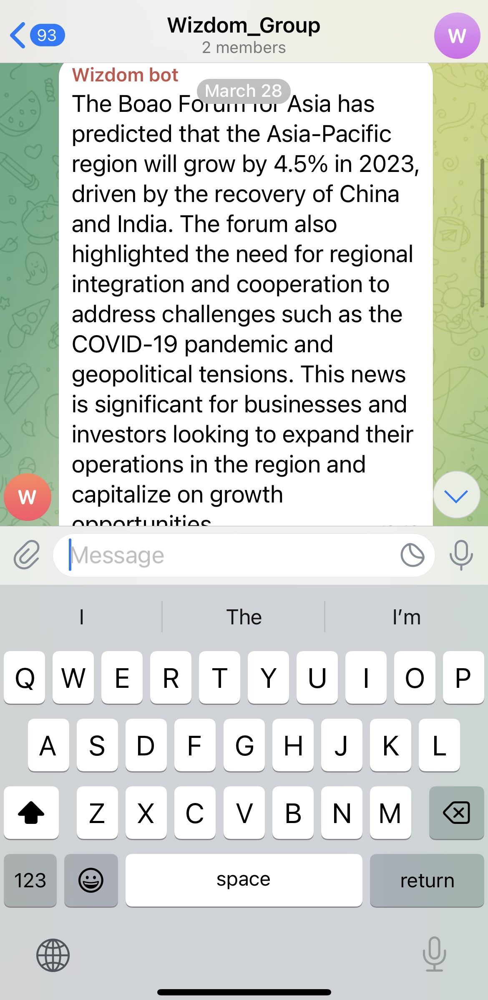

# Wizdom

Get up to speed with distilled news in 5 minutes.

- Are you constantly distracted by the latest news gossip?
- Do you find catching up to news is too time consuming?
- Do you feel FOMO if you stop scrolling?

Reclaim your time and attention with Wizdom.

### Motivation

- Reduce the constant distractions caused by news overload with an AI-distilled news digest.
- Stick closer with financial news and get up-to-date to the market.

### Features

- Scrape the weekly news
- Create a summary with AI (AWS Bedrock)
- Send the summary to Telegram recipients every Monday at 08:00 a.m.

### Stack used

- Python for web scraping
- AWS Bedrock - Llama2 13B as the AI provider
- AWS Lambda as compute
- AWS EventBridge as a scheduler (with Cron expression)
- Telegram as spreading channel

### Cost

- USD 0.3 per month

### Result
